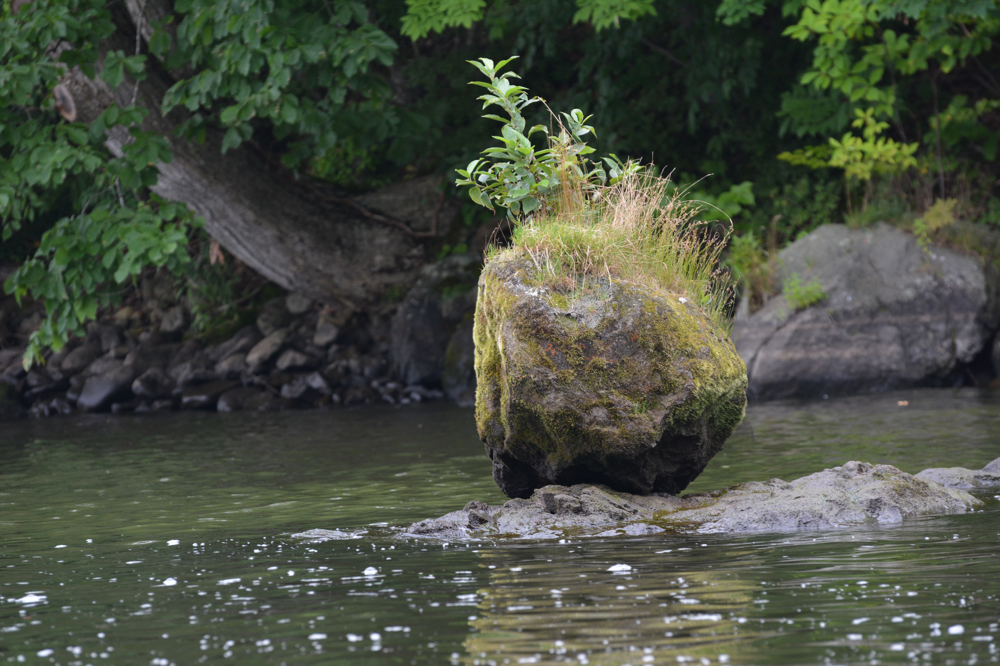

# About Me

I'm a third year PhD student at the University of Bonn supervised by [Markus Hausmann](https://staff.math.su.se/markus.hausmann/).

Before that, I finished my master's degree at the Freie Universität Berlin supervised by [Gabriel Angelini-Knoll](https://www.gangeliniknoll.com/).

Before that, I was an undergrad in mathematics and physics at KU Leuven.

A complete CV is available upon request.

**Note**
from September 2022 to August 2023, Markus and I were at Stockholm University, please do not use my SU email address as it is closed.

**My research interests include**

-Equivariant and global homotopy theory, equivariant generalisations of chromatic homotopy theory, equivariant formal groups.

-K-theory, motivic cohomology, trace methods, the even filtration and its relation to synthetic spectra and equivariant formal groups.
