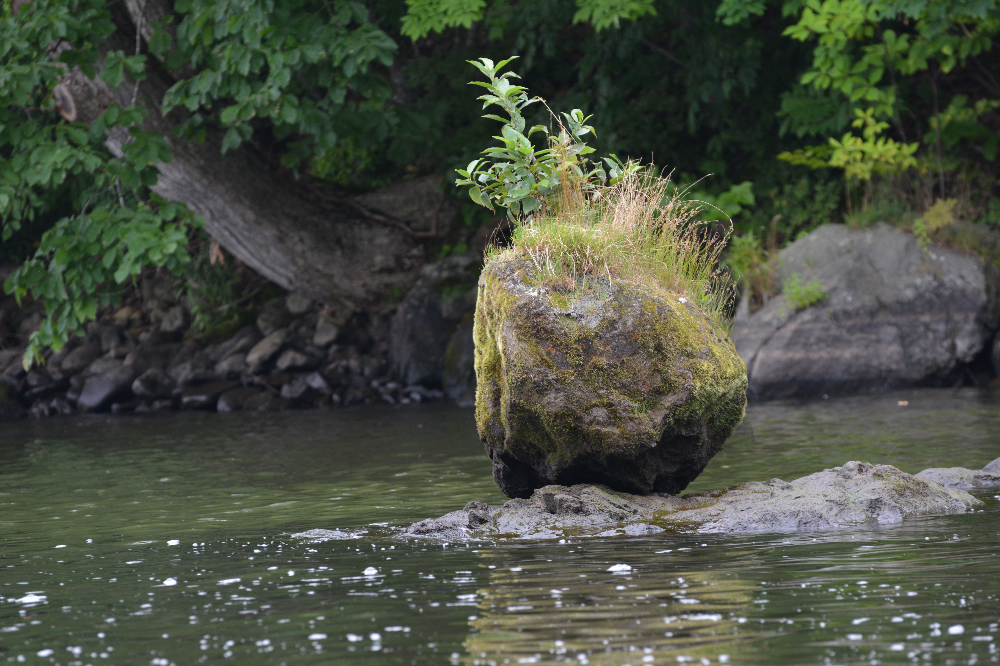

# About Me

***Presently,***

I'm a third year PhD student at the University of Bonn supervised by [Markus Hausmann](https://staff.math.su.se/markus.hausmann/).

***Forthcomingly,***

Starting in October 2026, I'll be a postdoc at Mathematics Münster in the context of a Young Research Group joint with [Anish Chedalavada](https://aragogh.github.io/) and [Florian Riedel](https://spectralscheme.gitlab.io/).

***Previously,***

Before that, I finished my master's degree at the Freie Universität Berlin supervised by [Gabriel Angelini-Knoll](https://www.gangeliniknoll.com/).
Before that, I was an undergrad in mathematics and physics at KU Leuven.

A complete CV is available upon request.

**My research interests:**

I am broadly interested in ((chromatic) equivariant) stable homotopy, studied through the lens of synthetic/motivic/even filtered techniques. Examples include the following:

-The interaction between the even filtration and (global) equivariance, as mediated by equivariant motivic homotopy theory.

-The geometry of oriented global group laws (an "elliptic" style decompletion of the Quillen formal group on an even ring spectrum).

-Geometric representation theory over complex bordism or the sphere spectrum.
