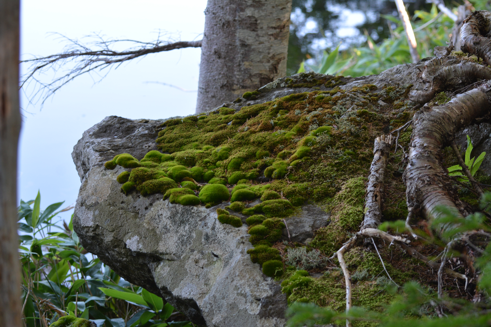

# Research

#### Here are my past and current research projects.
***Current***

- **Synthetic isotropy separation**

  We lift the theory of isotropy separation to the level of synthetic equivariant spectra, allowing us to reduce questions about the equivariant Adams--Novikov spectral sequence to nonequivariant information by means of iterated recollements. As a first application, we express the equivariant Adams--Novikov spectral sequence (for a finite abelian group) in terms of motivic stable homotopy groups of étale classifying spaces using a synthetic tom Dieck splitting and confirm the existence of a vanishing line of slope and intercept zero resolving a conjecture of Carrick. Second, we revisit the theory of the filtered circle (à la Raksit, Antieau--Riggenbach, etc.) as a Borel completion of the theory of genuine synthetic circle-equivariant spectra. This is part of my thesis work and will be uploaded soon.

***Past***

- **Synthetic equivariant spectra for finite abelian groups and motivic homotopy theory** (j/w Keita Allen)
  
  We analyse an appropriate cellular subcategory of equivariant motivic spectra over the complex numbers and show that (after completion at an arbitrary prime) this is equivalent to a suitable category of synthetic equivariant spectra, which categorifies an equivariant version of the perfect even filtration which we further relate to the Adams--Novikov spectral sequence. The key input in this motivic comparison argument is a description of the homotopy groups of torus-equivariant algebraic cobordism which we deduce using global methods.
   [arXiv](https://arxiv.org/abs/2510.20197). An early research poster with a more accessible discussion can be found [here](./Piessevaux_bigs_poster.pdf)

- **Deformations of stable homotopy theory**

  This was my master's thesis in which I looked at a filtered model for synthetic spectra, and its interpretation as a relative affineness result.
  The thesis further attempts to construct a partial universal property for synthetic spectra as a deformation of spectra with a given algebraic fibre, in terms of this filtered characterisation. Available upon request.

