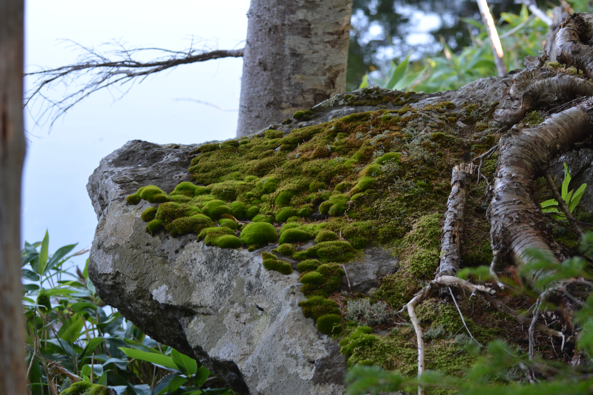

# Research

#### Here are my past and current research projects.
***Current***

- **An equivariant motivic reconstruction theorem**

  Pstrągowski gives a comparison theorem between cellular motivic spectra over the complex numbers and even synthetic spectra based on complex cobordism, proving that the former can be cosntructed purely using topology. This proof relies on the good behaviour of algebraic cobordism over the complex numbers and a few fundamental motivic computations. We investigate whether this admits equivariant generalisations, i.e. whether there is an analogous topological reconstruction theorem for cellular motivic spectra over quotient sstacks obtained from trivial actions of finite constant group scheme on the complex numbers.
  
- **An equivariant Adams spectral sequence based on MO**

  My current PhD project. The global spectrum **MO** for elementary abelian 2-groups represent the universal equivariant 2-torsion global group law. Further, at the trivial group its associated Hopf algebroid is equivalent to the classical dual Steenrod algebra. Their respective Adams spectral sequences are related by a series of Bockstein spectral sequences, which give us a systematic way to produce classes in an equivariant analogue of the Adams spectral sequence. A poster with a broad discussion of this project can be found [here](./Piessevaux_poster.pdf)
  
***Past***
- **Deformations of stable homotopy theory**

  This was my master's thesis in which I looked at a filtered model for synthetic spectra.
  The thesis attempts to construct a universal property for these as a deformation of spectra with a given algebraic fibre, in terms of filtered spectra. (pdf forthcoming)

